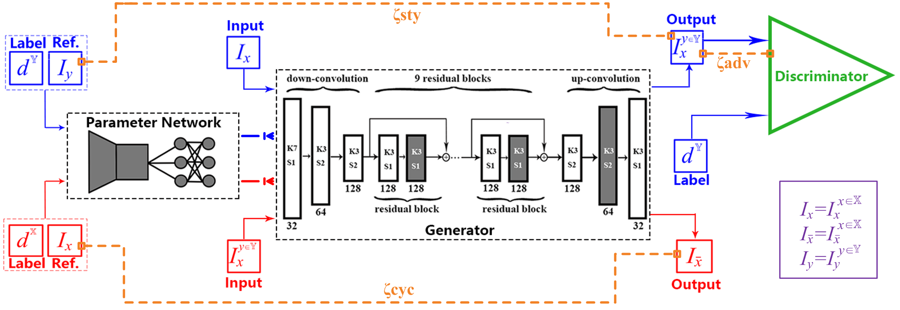
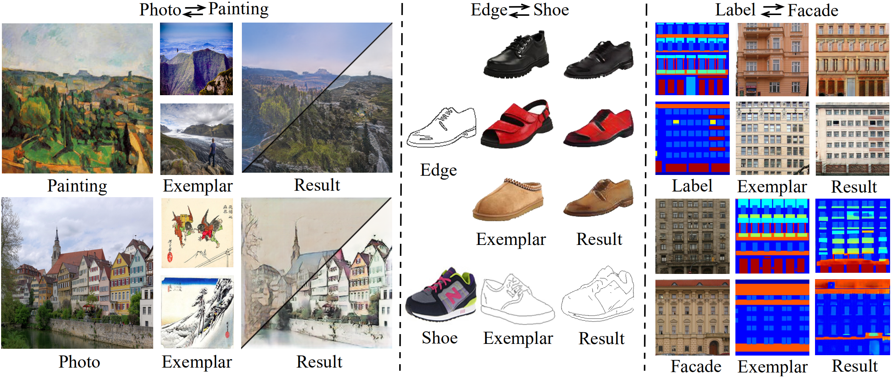
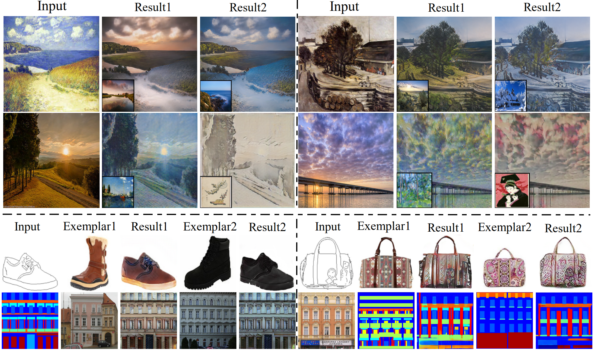

# The code for EDIT: Exemplar-Domain Aware Image-to-Image Translation

## Introduction
This is the code for paper "EDIT: Exemplar-Domain Aware Image-to-Image Translation" （https://arxiv.org/abs/1911.10520 ）, which is based on pyTorch implementation of paper "meta network for neural style transfer" (from https://ypw.io/style-transfer/ ) and cycleGAN (from https://github.com/junyanz/pytorch-CycleGAN-and-pix2pix ). We design a novel generative adversarial network, namely exemplar-domain aware image-to-image translator (EDIT for short). The principle behind is that, for images from multiple domains, the content features can be obtained by a uniform extractor, while (re-)stylization is achieved by mapping the extracted features specifically to different purposes (domains and exemplars). The generator of our EDIT comprises of a part of blocks configured by shared parameters, and the rest by varied parameters exported by an exemplar-domain aware parameter network. In addition, a discriminator is equipped during the training phase to guarantee the output satisfying the distribution of the target domain. Our EDIT can flexibly and effectively work on multiple domains and arbitrary exemplars in a unified neat model.

## Network Architecture


## Dependnecy
python 3.5, pyTorch >= 1.4.0 (from https://pytorch.org/), numpy, Pillow.
## Usage

### Training
1. Download the dataset you want to use and change the dataset directory. More datatsets can be found https://people.eecs.berkeley.edu/~taesung_park/CycleGAN/datasets/

2. Starting training using the following command

```python train.py```

If one want to use the exemplar image which doesn't belong to target domain, just starting training using the following command

```python train_CrossDomain.py```
 
### Testing
1. Put the pre-trained model in your own path and change the checkpoint path of the code
2. Starting testing using the following command

```python test.py```

## Results


More Results can be found in our website: https://forawardstar.github.io/EDIT-Project-Page/

## Implementation Details
When translating shoes/handbags to shoes or translating facades (buildings) to semantic maps, style loss is not needed. Thus, our code in 'train.py' use a if statement to distinguish shoes/handbags to shoes and facades to maps from the other domains. In the special case of this code. 

## Citation
```
@misc{fu2019edit,
    title={EDIT: Exemplar-Domain Aware Image-to-Image Translation},
    author={Yuanbin Fu and Jiayi Ma and Lin Ma and Xiaojie Guo},
    year={2019},
    eprint={1911.10520},
    archivePrefix={arXiv},
    primaryClass={cs.CV}
}
```
